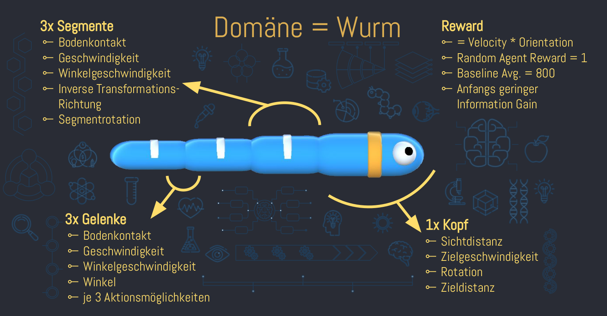

# All You Can Creep

# Presentations

[14.12.2020 Presentation KickOff](Presentations/ASP_20201214_KickOff.pdf)

[Final Presentation](Presentations/ASP_Final_Presentation.pdf)

# Links

[Examples](https://github.com/Unity-Technologies/ml-agents/blob/master/docs/Learning-Environment-Examples.md)

[Installation](https://github.com/Unity-Technologies/ml-agents/blob/release_10_docs/docs/Installation.md)

[ML Agents](https://github.com/Unity-Technologies/ml-agents/blob/master/docs/Python-API.md)

[Gym Wrapper](https://github.com/Unity-Technologies/ml-agents/blob/master/gym-unity/README.md)

[Environment Exec](https://github.com/Unity-Technologies/ml-agents/blob/master/docs/Learning-Environment-Executable.md)

# Work Distribution

All coding has been done by at least two people at the same time in Pair-Programming.
Therefore, we used [Visual Studio Code](https://code.visualstudio.com/) with [Live Share](https://visualstudio.microsoft.com/services/live-share/), so everyone could participate and write simultaneously.
Because at least two people (sometimes 3 or even all 4) have been coding at the same time, everyone has a basic understanding of A2C and PPO. As requested, we divided the different tasks among us in form of experts. The division can be seen in the following table:

| Topic                     |    Name   |                                   Info |
| ------------------------- | :-------: | -------------------------------------: |
| A2C                       |           |                                        |
| Split- & Multihead NN     |   Sofie   |                                        |
| Activation                | Balthasar | Sigmoid, Softplus, Softmax, TanH, ReLu |
| Min-Max-Clamping          | Balthasar |                                        |
| Loss & Entropy            | Balthasar |                                        |
| Advantages                |   Sofie   |             A2C, TD, 3-Step, Reinforce |
| Return                    |   Sofie   |                                        |
| A2C vs A3C                |   Sofie   |                                        |
| -----                     |   -----   |                                  ----- |
| PPO                       |           |                                        |
| Actor & Critic NN         |   Lukas   |                                        |
| Memory, Buffer, Batches   |   Lukas   |                                        |
| Hyperparameter            |   Denny   |                                        |
| Reward                    |   Denny   |                                        |
| log_prob & prob_ratio     |   Denny   |                                        |
| weighted_probs & clipping |   Lukas   |                                        |
| -----                     |   -----   |                                  ----- |
| Slurm                     |   Denny   |                           Slurm Runner |
| Parameter Search          |   Sofie   |    Grid Search, Evolutionary Algorithm |
| Environments + Unity      |   Lukas   |                                        |
| Ml-Flow                   | Balthasar |                    Measures, Artifacts |
| Save and Load Models      | Balthasar |                                        |
